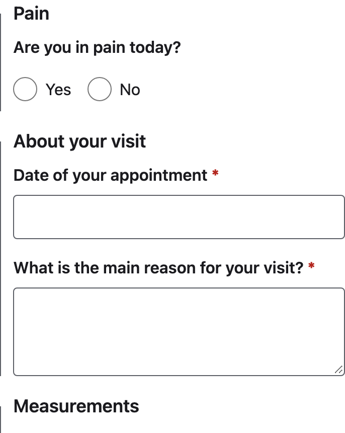

# FHIR Questionnaire Kit

Render a FHIR **R4 (4.0.1)** `Questionnaire` as an accessible form and get
back a valid `QuestionnaireResponse`, with no dependencies, no data leaving the
page and no platform to adopt.



- **Zero runtime dependencies.** No published package bundles anything from
  `node_modules`, and CI fails the build if one does
  ([bundle gate](scripts/measure-bundles.mjs), [its test](scripts/test/measure-bundles.test.js)).
- **No PHI leaves the page.** The kit stores nothing and sends no answer
  anywhere. A lint rule forbids network calls ([`no-network`](tools/eslint-rules/src/no-network.js)),
  and a test runs a whole session with every door trapped ([`no-io.test.ts`](packages/core/test/safety/no-io.test.ts)).
  The one exception is the element's, and only when you ask for it: a `GET`
  for its `src` and for value-set expansions.
- **No platform.** No backend, account or server. Storage, transport and
  identity stay the host's, and the [playground](https://eugenedumanskyi.github.io/fhir-questionnaire-kit/playground/)
  is static files that the browser forbids to connect anywhere
  ([privacy spec](tests/browser/playground-privacy.spec.ts)).

```sh
npm install @fhirq/react @fhirq/themes react react-dom
```

<!-- snippet: examples/react-quickstart/src/render.tsx -->
```tsx
import { Questionnaire } from '@fhirq/react';
import '@fhirq/themes/base.css';
import '@fhirq/themes/default.css';
import { intake } from './intake.js';

export const Form = () => <Questionnaire questionnaire={intake} />;
```

That renders the form. To complete it with your own submit button and receive
the response, add the hook: [the React quickstart](examples/react-quickstart/README.md),
13 lines. Both are compiled and rendered in CI.

## Status

Pre-release, at milestone **M10** of eleven. The engine, the presentation
model, both renderers, the themes and the playground are built and gated.
**Nothing is on npm yet:** the packages publish as 1.0.0 at M11, so until then
the install command above does not work, and the packages are built from this
repository. See the [roadmap](docs/06-roadmap.md).

## Packages

| Package | What it is |
|---|---|
| `@fhirq/core` | The engine: conditions, groups and repeats, validation, save and resume, answer retention. `@fhirq/core/view` is the presentation model |
| `@fhirq/react` | Hooks and a default UI over the presentation model, React 18 and 19 |
| `@fhirq/element` | `<fhir-questionnaire>`, a custom element in shadow DOM, no framework |
| `@fhirq/themes` | `base.css` and token presets, as `--fhirq-*` custom properties |

## Published numbers

Bundle sizes are minified and gzipped, in kB of 1,000 bytes; CI fails the build
on a published entry point over its figure. The scale and depth figures are the
ceiling the engine is tested and benchmarked at, and loading past a depth figure
is refused. Every figure here is checked in CI against its source, so this
table cannot drift from what is enforced. The 50 instances are tested headroom,
not a size drawn from real responses.

<!-- numbers:start -->
| Figure | Published | Source |
|---|---|---|
| `@fhirq/core` | ≤ 15 kB | NFR-S-02, [`budgets.json`](scripts/budgets.json) |
| `@fhirq/core/resume`, beyond core | ≤ 4 kB | NFR-S-02, [`budgets.json`](scripts/budgets.json) |
| `@fhirq/core/view` | ≤ 8.2 kB | NFR-S-02, [`budgets.json`](scripts/budgets.json) |
| `@fhirq/react`, beyond React and core | ≤ 6 kB | NFR-S-02, [`budgets.json`](scripts/budgets.json) |
| `@fhirq/element`, with core, view and the default theme | ≤ 31.7 kB | NFR-S-02, [`budgets.json`](scripts/budgets.json) |
| `@fhirq/element` as one `<script>` (IIFE) | ≤ 31.9 kB | NFR-S-03, [`budgets.json`](scripts/budgets.json) |
| `@fhirq/themes/base.css` | ≤ 4 kB | NFR-S-02, [`budgets.json`](scripts/budgets.json) |
| `@fhirq/themes` preset, each | ≤ 3 kB | NFR-S-02, [`budgets.json`](scripts/budgets.json) |
| Items in one questionnaire | 1,000 | NFR-P-04, [`ceiling.json`](fixtures/bench/ceiling.json) |
| `enableWhen` conditions | 500 | NFR-P-04, [`ceiling.json`](fixtures/bench/ceiling.json) |
| Instances of one repeating group | 50 | NFR-P-04, [`ceiling.test.ts`](packages/core/test/property/ceiling.test.ts) |
| Items in one repeat instance | 20 | NFR-P-04, [`ceiling.json`](fixtures/bench/ceiling.json) |
| Groups nested inside one another | 10 | NFR-P-05, [`graph.ts`](packages/core/src/definition/graph.ts) |
| Conditions in one `enableWhen` chain | 10 | NFR-P-05, [`graph.ts`](packages/core/src/definition/graph.ts) |
<!-- numbers:end -->

## Documentation

- [Docs site](https://eugenedumanskyi.github.io/fhir-questionnaire-kit/) and
  [playground](https://eugenedumanskyi.github.io/fhir-questionnaire-kit/playground/).
- [Guides](docs/guides/README.md), task by task from a first form to a scored
  one. Every code block in them is compiled and run in CI.
- [Conformance matrix](docs/conformance/matrix.json): every feature in scope,
  supported or not, with the reason and the test behind each row.
- [API reference](docs/07-api.md), [architecture decisions](docs/adr/README.md)
  and the [accessibility record](docs/accessibility.md).

`docs/` also carries the reasoning, meant to be read rather than skimmed: the
brief, requirements and acceptance criteria, the NFRs and their gates, the
domain model, the architecture and the roadmap.

## Not a medical device

The kit renders a questionnaire and records the answers. It does not interpret
them, it is not a medical device, and it makes no safety claim. Validating an
instrument, its wording and any score for clinical use is the adopter's
responsibility.

## Support and security

There is no support commitment: issues are triaged monthly, and there is no
timeline for features or questions.

The one commitment is to security reports. Report a vulnerability privately
through [GitHub's private vulnerability reporting](https://github.com/EugeneDumanskyi/fhir-questionnaire-kit/security/advisories/new),
never in a public issue. A report is acknowledged within **7 days**, and patched
or publicly documented within **30 days**. See [`SECURITY.md`](SECURITY.md).

## Working on it

Node is pinned in `.nvmrc` and pnpm in `package.json`'s `packageManager`.
Node 25 and later no longer bundle Corepack, so install it once:

```sh
npm install --global corepack && corepack enable pnpm
pnpm install
pnpm typecheck   # tsc --build across the workspace
pnpm lint        # ESLint, including the architectural rules, and the docs and numbers checks
pnpm test        # Vitest, Node only
```

## Licence

Apache-2.0 — see `LICENSE` and `NOTICE`. HL7® and FHIR® are trademarks of
Health Level Seven International; this project is not affiliated with or
endorsed by HL7.
