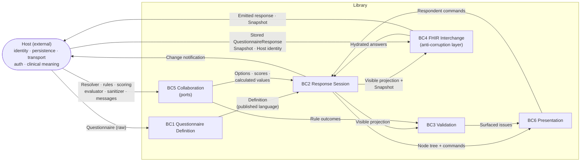
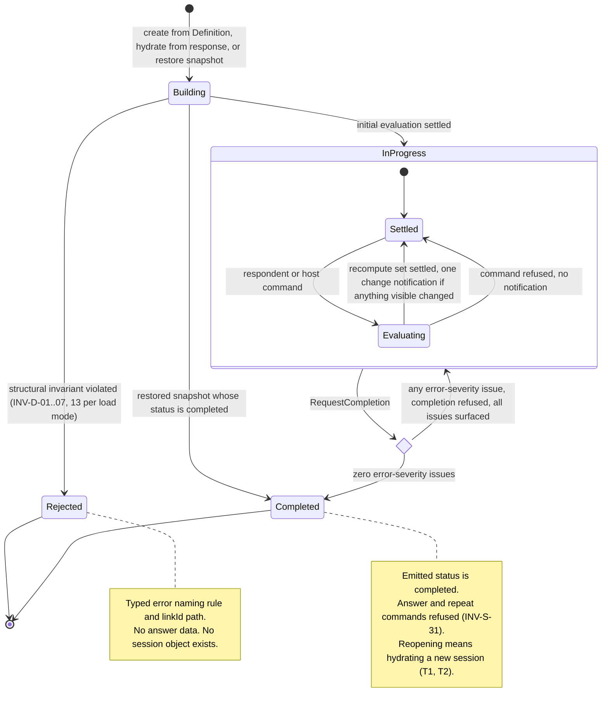
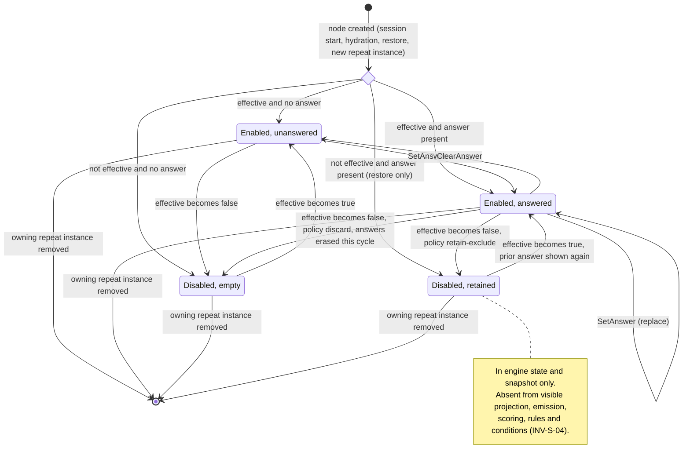
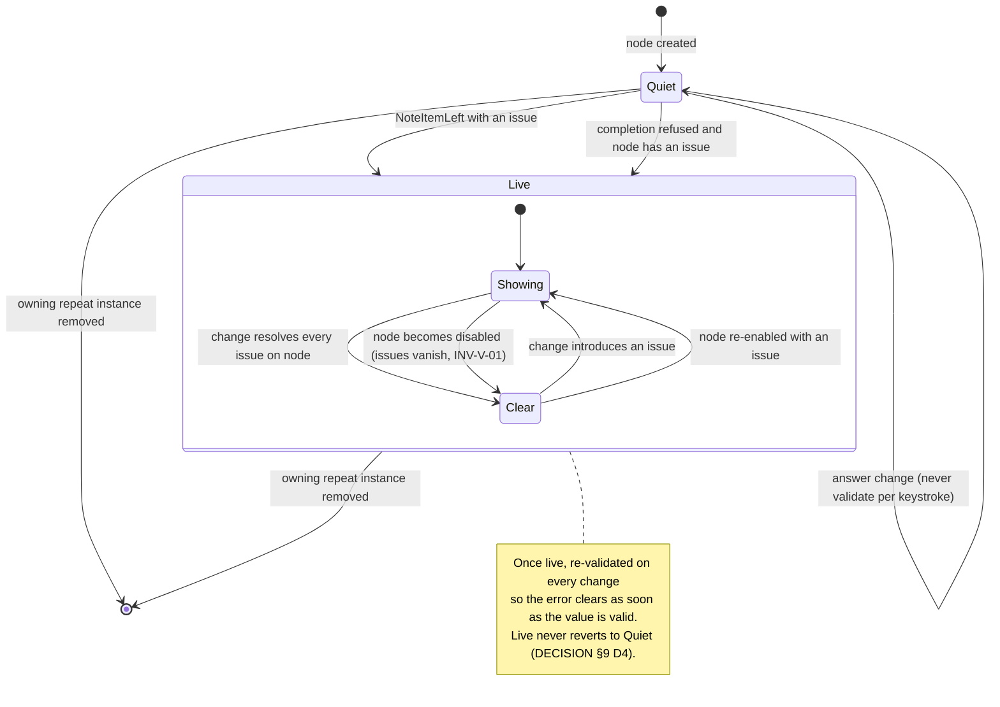
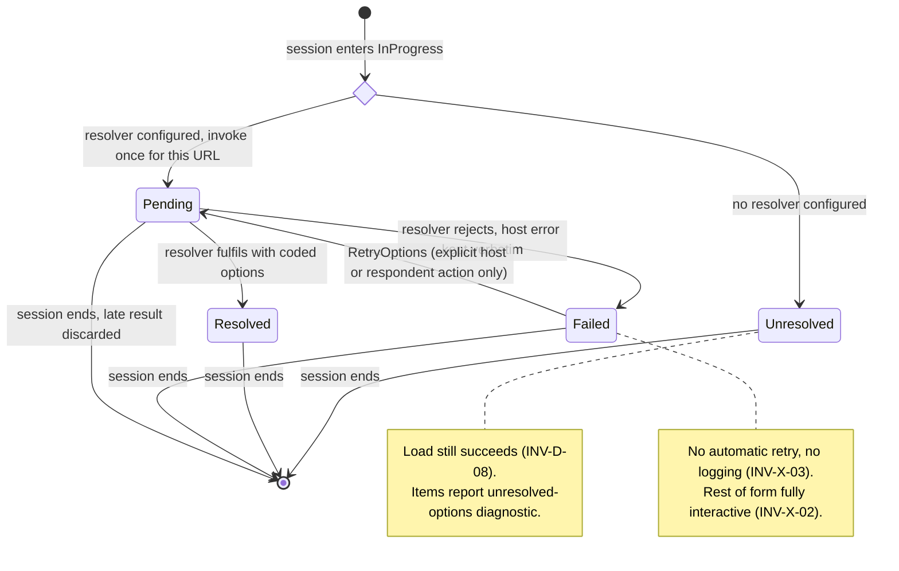
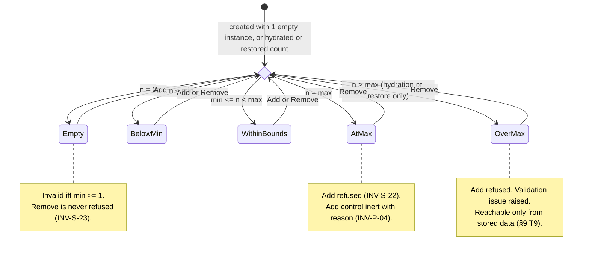

# FHIR Questionnaire Kit — Domain Model

*Phase: domain modelling. Input: `02-requirements.md` (with `01-brief.md` and `03-nfr.md` for context). Output: bounded contexts, entities, invariants, long-running state machines. Next: architecture → milestones → build.*

**No technology choices are made here.** Packages, frameworks, rendering mechanisms and data structures belong to architecture. Where a requirement names one (a hook, a web component, shadow DOM), this document models only the domain concept underneath it.

---

## 0. How to read this document

- **Traceability.** Every invariant cites the acceptance criteria it comes from (`AC-…`). An invariant marked `DECISION` originated in this document; each is collected in §9 and now also traces to an acceptance criterion via `02-requirements.md` §19.
- **IDs.** Invariants are `INV-<context>-<nn>`. State machines are `SM-<nn>`.
- **Tensions.** Where two requirements pull against each other, or a requirement is silent on a case the model must answer, it is raised in §9 with a recommended resolution — not silently decided.
- **Derived vs stored.** The most important distinction in this model. A lot of what looks like state (enablement, validity, the emitted response, scores) is *derived* from a small amount of truly stored state (answers, repeat instances, surfacing history, lifecycle status). Each concept below is labelled one or the other.

---

## 1. Ubiquitous language

Extends the vocabulary in `02-requirements.md` §0. Terms in this table are used with exactly this meaning in code, docs and ADRs.

| Term | Meaning | Not to be confused with |
|---|---|---|
| **Questionnaire** | The authored FHIR R4 resource as received from the host. Untrusted input. | *Definition* |
| **Definition** | The checked, immutable, compiled form of a Questionnaire: item tree, dependency graph, load diagnostics. Created once per session. | *Questionnaire* (raw input) |
| **Item definition** | One authored item (`linkId`, type, constraints, conditions). Exists once per Definition. | *Item node* |
| **Item node** | A runtime occurrence of an item definition at a specific *item path*. An item definition inside a repeating group has one node per group instance. | *Item definition* |
| **Item path** | Address of an item node: the chain of `linkId`s from root, with a *repeat ordinal* at each repeating group. Stable for the node's lifetime. | Document position / display index |
| **Repeat instance** | One occurrence of a repeating group. Has a *repeat ordinal* (identity, never reused) and a *position* (order, changes on removal). | Answer repetition on a non-group item |
| **Answer** | A typed value held by an item node. A repeating non-group node holds an ordered list of answers. | *Emitted answer* |
| **Own condition** | The result of evaluating an item's `enableWhen` + `enableBehavior` in isolation. Derived. | *Effective enablement* |
| **Effective enablement** | `own condition ∧ parent effectively enabled`. This is what "enabled/disabled" means everywhere else in this document. Derived. | *Own condition* |
| **Retained answer** | An answer held by a node that is currently disabled. Present in engine state, invisible to every consumer except the snapshot. | *Emitted answer* |
| **Retention policy** | Session-wide rule for what happens to an answer when its node becomes disabled: `retain-exclude` (default) or `discard`. | — |
| **Visible projection** | The view of engine state restricted to effectively enabled nodes. The *single* view consumed by emission, scoring, cross-field rules and required-validation. Derived. | *Snapshot* |
| **Snapshot** | Full-fidelity serialization of engine state, including retained answers and repeat ordinals. Consumed only by restore. | *Emitted response* |
| **Emitted response** | The `QuestionnaireResponse` built from the visible projection plus host identity and lifecycle status. Derived. | *Snapshot* |
| **Host identity** | `subject`, `author`, `encounter`, `identifier` — supplied by the host, never inferred. | — |
| **Diagnostic** | A finding about the *questionnaire, stored response or integration* (unsupported type, dangling reference, version drift, resolver failure, rule threw). Audience: integrator. Never carries answer values. | *Validation issue* |
| **Validation issue** | A finding about the *respondent's answers* (`required`, out of range, cross-field). Audience: respondent and host UI. | *Diagnostic* |
| **Surfacing** | Whether a validation issue on a node is currently shown to the respondent. Stored per node; the issue itself is derived. | *Validity* |
| **Evaluation cycle** | The atomic unit of change: one command → all derived state settles → at most one change notification. | — |
| **Load mode** | `strict` (default) or `lenient`. Decides whether structural defects reject the session or degrade to diagnostics. | Validation strictness |
| **Collaborator** | A host-supplied function the domain calls but does not own: option resolver, scoring function, cross-field rule, expression evaluator, sanitizer, message catalogue. | — |

---

## 2. Context map

Six bounded contexts inside the library, plus the **Host** as an external context that owns everything the library refuses to (identity, persistence, transport, auth, tenancy, clinical meaning).

| # | Bounded context | Kind | Core question it answers |
|---|---|---|---|
| BC1 | **Questionnaire Definition** | Core | *Is this questionnaire something we can faithfully run, and what does its logic graph look like?* |
| BC2 | **Response Session** | Core — the heart | *Given the answers so far, what is enabled, what is retained, and what instances exist?* |
| BC3 | **Validation** | Core | *Are the visible answers acceptable, and which problems should the respondent see right now?* |
| BC4 | **FHIR Interchange** | Supporting — anti-corruption layer | *How does engine state become a `QuestionnaireResponse`, and how does a stored one become engine state?* |
| BC5 | **Collaboration** | Supporting — ports to the host | *What does the host plug in, and how do we stay safe when it misbehaves?* |
| BC6 | **Presentation** | Supporting | *How is a node shown, operated and announced to a respondent, at whatever customization tier?* |

The **playground**, **conformance matrix**, **ADRs** and **release evidence** (E12–E15) are *consumers* of the model, not domains with their own rules about questionnaires. They are covered briefly in §3.7 because two of them carry real invariants.

**Relationship patterns.**

| Upstream → Downstream | Pattern | Why |
|---|---|---|
| Host → BC1 | *Conformist* to FHIR R4 | The spec is not ours to change; we reject or degrade, never reinterpret. |
| BC1 → BC2 | *Published language* | The Definition is immutable once built; BC2 never reads the raw Questionnaire. |
| BC2 → BC3, BC4, collaborators | *Open host service* via the visible projection | One projection, many consumers — this is what makes "disabled means invisible" a single rule rather than four. |
| FHIR ↔ BC2 | *Anti-corruption layer* (BC4) | Engine state and the FHIR document are deliberately different shapes (AC-05.3.2). |
| Host ↔ BC5 | *Separate ways*, bridged by ports | Host failure shapes are passed through verbatim (AC-07.1.2); the library adds no policy. |
| BC2 → BC6 | *Customer/supplier*, BC6 conformist | Presentation owns no domain state; the headless tier proves the supplier's model is sufficient (AC-08.2.1). |

**Shared kernel** (used identically by all contexts): `LinkId`, `ItemPath`, `ItemType`, `Diagnostic`, `Severity`.

---

## 3. Bounded contexts in detail

Legend: **AR** aggregate root · **E** entity (identity, lifecycle) · **VO** value object (immutable, compared by value) · **D** derived (recomputed, never stored).

### 3.1 BC1 — Questionnaire Definition

**Purpose.** Turn an untrusted Questionnaire into a Definition that BC2 can run without ever re-checking it — or refuse precisely. All structural problems are found here, at load, not at the first keystroke (US-01.3, US-02.5).

| Concept | Kind | Notes |
|---|---|---|
| **Definition** | AR | Immutable after construction. Owns the item tree, the dependency graph and load diagnostics. One per session. |
| Item definition | E | Identity = `linkId`. Carries type, `required`, `repeats`, constraint set, text, answer options or value set reference, units, conditions, extensions of interest. |
| Enable-when condition | VO | `(question linkId, operator, expected answer)`. Belongs to exactly one item definition. |
| Enable behaviour | VO | `all` \| `any`; defaults to `all` (AC-02.3.3). |
| Answer option | VO | Coded option declared inline. |
| Value set reference | VO | Canonical URL. Resolution is **not** a BC1 concern — BC1 only records that it exists. |
| Unit option | VO | `(system, code, display)` permitted for a `quantity` item. |
| Constraint | VO | `maxLength`, `minValue`, `maxValue`, `maxDecimalPlaces`, `minOccurs`, `maxOccurs`. |
| Presentation hint | VO | `itemControl` code (radio-button, drop-down, check-box), `rendering-xhtml` content. Recorded, not interpreted. |
| Expression binding | VO | A `calculatedExpression` extension routed to the expression seam (AC-07.3.1). Other expression extensions are load findings (INV-D-15). |
| Dependency graph | VO | Directed acyclic graph: edge from *question* item to *dependent* item. Also records the *scope* in which each edge resolves (same repeat instance vs global — see §9 T3). |
| Load mode | VO | `strict` \| `lenient`. |
| Diagnostic | VO (kernel) | `{ code, severity, path, rule, message }` — never an answer value. |

**Does not own:** answers, option lists fetched at runtime, rendering choices, any notion of a respondent.

---

### 3.2 BC2 — Response Session (the core domain)

**Purpose.** Hold the respondent's work and keep every derived fact about it consistent after every command, in one evaluation cycle. This is the "rules engine that is the actual product" (E02 goal).

| Concept | Kind | Notes |
|---|---|---|
| **Response session** | AR | The consistency boundary. All commands enter here; all invariants in §5.2 hold at the end of every evaluation cycle. |
| Item node | E | Identity = item path. Created with its parent (root nodes at session creation; group-descendant nodes with their repeat instance). |
| Repeat instance | E | Identity = `(group item path, repeat ordinal)`. Has a mutable *position* among its siblings. |
| Answer | VO | Typed: boolean, decimal, integer, date, dateTime, string, text, coding, free-text (open-choice), quantity. |
| Answer list | VO | Ordered answers on one node; length ≤ 1 unless the item `repeats`. |
| Retention policy | VO | `retain-exclude` (default) \| `discard` (AC-05.2.3). Session-wide, fixed at creation (R6). |
| Lifecycle status | VO | `in-progress` \| `completed` — see SM-01. |
| Host identity | VO | Optional; stored verbatim (AC-05.1.2). |
| Option set | E | Per value set reference, per session — see SM-04. Lives here because it gates what answers are selectable; the *fetching* is BC5. |
| Own condition | D | Per item node, from the dependency graph and current answers. |
| Effective enablement | D | Per item node. |
| Visible projection | D | The read-only view published to BC3, BC4 and collaborators. |
| Recompute set | D | For one changed node: the transitive dependents in the graph, scoped to the right repeat instance (AC-02.2.3, NFR-P-09). |
| Score result | D | Opaque value from a host scoring function, recomputed on contributing change (AC-07.2.1). The engine never interprets it. |
| Calculated value | D | Value produced by the expression seam for an expression-bound item (AC-07.3.2). |
| Session diagnostics | E (collection) | Load diagnostics copied from the Definition, plus runtime diagnostics (rule threw, resolver failed, orphan answer, drift). |

**Commands:** `SetAnswer(path, answers)`, `ClearAnswer(path)`, `AddRepeatInstance(groupPath)`, `RemoveRepeatInstance(groupPath, ordinal)`, `NoteItemLeft(path)` (the domain meaning of "blur"), `RequestCompletion`, `RetryOptions(valueSetRef)`.

**Does not own:** the FHIR document shape, how an issue is phrased or displayed, persistence, timers.

---

### 3.3 BC3 — Validation

**Purpose.** Decide what is wrong with the visible answers and — separately — what the respondent should be *told* is wrong at this moment. The first is pure and derived; the second is the only stored state in this context.

| Concept | Kind | Notes |
|---|---|---|
| **Validation result** | D (AR of a read model) | Ordered list of issues in document order (AC-04.4.1). Serializable. Recomputed; never persisted. |
| Validation issue | VO | `{ path, linkId, code, message, severity }`, `severity ∈ { error, warning }`. `path` absent ⇒ form-level (AC-04.3.1). |
| Built-in rule | VO | Derived from Definition constraints: required, maxLength, min/maxValue, maxDecimalPlaces, date syntax vs range (AC-04.2.2), unit present for quantity (AC-01.2.4), min/maxOccurs. |
| Cross-field rule | VO (collaborator reference) | Host function over named item paths → message or none (AC-04.3.1). |
| Surfacing state | E | One per item node. Identity = item path. See SM-03. |
| Surfacing mode | VO | `blur-then-live` (default, R5) or an alternative configured per NFR-U-03. |
| Completion verdict | D | `accepted` \| `refused(issues)`. Input to SM-01. |

**Does not own:** the message text (BC5 message catalogue supplies it), where the error summary is placed or how focus moves (BC6).

---

### 3.4 BC4 — FHIR Interchange

**Purpose.** Translate in both directions between engine state and the FHIR `QuestionnaireResponse`, so that no FHIR shape leaks into BC2 and no engine-only state leaks into FHIR (US-05.3).

| Concept | Kind | Notes |
|---|---|---|
| **Emitted response** | D | Built from visible projection + host identity + lifecycle status + `authored` timestamp. Nested `item` tree mirroring the Definition, enabled and answered nodes only (AC-05.1.1). |
| **Snapshot** | D (serialized) | Full engine state: every node's answers including retained, repeat ordinals and positions, surfacing state, lifecycle status, retention policy, host identity. JSON-serializable (AC-05.3.1). |
| Hydration source | VO | A stored `QuestionnaireResponse` paired with a Definition. |
| Hydration report | VO | Orphan answers, quarantined answers, version drift — all as diagnostics (AC-06.1.3, AC-06.3.1, AC-06.3.2). |
| Canonical reference | VO | `url` + optional `version` of the Questionnaire. Basis of drift detection. |

**Two distinct entry paths into BC2, deliberately not merged:**

| Path | Source | Fidelity | Retained answers survive? |
|---|---|---|---|
| **Hydrate** | Emitted response | Lossless for *enabled* items only (AC-06.1.2) | No — they were never emitted |
| **Restore** | Snapshot | Exact (AC-05.3.1) | Yes |

This asymmetry is a consequence of the retention decision, not an accident: if a host wants mis-click protection to survive a page reload, it must persist the snapshot, and the snapshot is engine state rather than a clinical record. State this in the retention ADR.

---

### 3.5 BC5 — Collaboration

**Purpose.** Define the ports through which the host injects behaviour, and the safety rules around calling foreign code. The library's *boundary discipline* (Brief §6 principle 2) lives here.

| Port | Shape (domain terms) | Failure handling | Source |
|---|---|---|---|
| Option resolver | async: canonical URL → coded options | Error exposed verbatim; no retry, no logging by the library | US-07.1 |
| Cross-field rule | sync, pure: visible projection → message \| none | Throw ⇒ diagnostic; interaction continues | AC-04.3.2 |
| Scoring function | sync, pure: visible projection → opaque result | Throw ⇒ result cleared + diagnostic, mirrors rules | US-07.2, AC-07.2.4 |
| Expression evaluator | expression + visible projection → value | Absent ⇒ diagnostic, load still succeeds; throw ⇒ value cleared + diagnostic | US-07.3, AC-07.3.4 |
| Sanitizer | rich text → safe rich text | Absent ⇒ plain text + diagnostic | AC-01.4.2 |
| Message catalogue | key → string, partial override | Missing key ⇒ built-in default | US-07.4 |

A **default option resolver** (plain GET against a base URL) exists for the embed case (AC-07.1.3). In domain terms it is simply *one host-side implementation of the port*, shipped for convenience — it is outside the network-incapable core by definition, and nothing in BC1–BC4 can tell it apart from any other resolver.

---

### 3.6 BC6 — Presentation

**Purpose.** Map item nodes to operable, perceivable controls at a chosen customization tier. It owns *no* domain state beyond transient UI concerns; the headless tier being able to rebuild the default UI is the proof (AC-08.2.1).

| Concept | Kind | Notes |
|---|---|---|
| Control choice | D | From item type + presentation hint; for `choice` without a hint: ≤ 5 options → radio, > 5 → listbox (AC-01.2.2, R1). |
| Customization tier | VO | `defaults` \| `tokens` \| `slots` \| `headless`. Changes rendering, never engine state (AC-12.4.1). |
| Control override | VO | Replacement for one item type; must receive value, change command, surfaced issues and accessibility identifiers (AC-10.3.1). |
| Accessibility identifiers | VO | Per node: control id, description id, invalid flag. Derived from item path. |
| Announcement | VO | Coalesced message per evaluation cycle: what changed, how many items (AC-11.3.2). |
| Error summary | D | The surfaced issues after a refused completion, each linking to its node (AC-11.3.1). |
| Unsupported placeholder | VO | For lenient-mode unsupported items (AC-01.3.2). |
| Theme | VO | Token set, light/dark; outside domain rules. |

---

### 3.7 Consumers with invariants of their own

Not bounded contexts of the questionnaire domain, but they hold rules the build must enforce.

| Consumer | Invariant | Source |
|---|---|---|
| **Conformance matrix** | Every row has status `supported` \| `partial` \| `not supported` \| `out of scope`; every `supported` row links a passing test; every exclusion has a reason. | AC-13.4.1, AC-13.4.2 |
| **Demo fixture** | Contains a ≥ 3-deep chain, a repeating group with per-instance conditions, both `any` and `all`, a cross-field rule, ≥ 8 item types, and a scored block — each asserted by a test. | AC-15.1.1 |
| **Playground workspace** | Pasted questionnaires and answers never leave the client; switching tier preserves answers (i.e. the session outlives its presentation). | AC-12.3.2, AC-12.4.1 |

---

## 4. Entity–relationship model

The diagram shows **stored** concepts and the **derived** projections that matter to invariants. Derived entities are marked in their comment; they have no independent lifecycle and are never persisted by the library. Presentation (BC6) is omitted — it holds no domain entities.

```mermaid
erDiagram
    QUESTIONNAIRE ||--|| DEFINITION : "compiled into"
    DEFINITION ||--|{ ITEM_DEFINITION : "contains (tree)"
    DEFINITION ||--|| DEPENDENCY_GRAPH : "owns"
    DEFINITION ||--o{ DIAGNOSTIC : "load findings"
    ITEM_DEFINITION ||--o{ ITEM_DEFINITION : "parent of"
    ITEM_DEFINITION ||--o{ ENABLE_WHEN_CONDITION : "declares"
    ENABLE_WHEN_CONDITION }o--|| ITEM_DEFINITION : "tests answer of"
    ITEM_DEFINITION ||--o{ ANSWER_OPTION : "offers inline"
    ITEM_DEFINITION |o--o| VALUE_SET_REFERENCE : "offers by reference"
    ITEM_DEFINITION ||--o{ UNIT_OPTION : "permits"
    ITEM_DEFINITION ||--o{ CONSTRAINT : "bounded by"
    ITEM_DEFINITION |o--o| EXPRESSION_BINDING : "calculated by"
    DEPENDENCY_GRAPH ||--o{ ENABLE_WHEN_CONDITION : "edge per"

    RESPONSE_SESSION }o--|| DEFINITION : "runs"
    RESPONSE_SESSION ||--|{ ITEM_NODE : "root nodes"
    RESPONSE_SESSION |o--o| HOST_IDENTITY : "carries"
    RESPONSE_SESSION ||--o{ OPTION_SET : "one per value set URL"
    RESPONSE_SESSION ||--o{ DIAGNOSTIC : "runtime findings"
    RESPONSE_SESSION ||--o{ COLLABORATOR_BINDING : "registered"
    OPTION_SET }o--|| VALUE_SET_REFERENCE : "resolves"

    ITEM_NODE }o--|| ITEM_DEFINITION : "occurrence of"
    ITEM_NODE ||--o{ ANSWER : "holds (ordered)"
    ITEM_NODE ||--o{ REPEAT_INSTANCE : "group instances"
    ITEM_NODE ||--o{ ITEM_NODE : "children (non-repeating group)"
    REPEAT_INSTANCE ||--|{ ITEM_NODE : "children"
    ITEM_NODE ||--|| SURFACING_STATE : "has"

    RESPONSE_SESSION ||--|| VISIBLE_PROJECTION : "derives"
    VISIBLE_PROJECTION ||--|| VALIDATION_RESULT : "validated into"
    VALIDATION_RESULT ||--o{ VALIDATION_ISSUE : "lists"
    VALIDATION_ISSUE }o--o| ITEM_NODE : "attached to"
    VISIBLE_PROJECTION ||--|| EMITTED_RESPONSE : "emitted as"
    VISIBLE_PROJECTION ||--o{ SCORE_RESULT : "scored into"
    RESPONSE_SESSION ||--|| SNAPSHOT : "serialized as"

    QUESTIONNAIRE {
        string url
        string version
        string fhirVersion "must be R4"
    }
    DEFINITION {
        string loadMode "strict | lenient"
        string canonical "url + version"
    }
    ITEM_DEFINITION {
        string linkId PK "unique in Definition"
        string type "supported set, or unsupported in lenient"
        boolean required
        boolean repeats
        string enableBehavior "all (default) | any"
        string text "plain; rich text only via sanitizer"
        string itemControl "hint, optional"
    }
    ENABLE_WHEN_CONDITION {
        string questionLinkId FK
        string operator "exists = != gt lt gte lte"
        string expectedAnswer "typed to question"
        string scope "same-instance | global"
    }
    ANSWER_OPTION {
        string system
        string code
        string display
    }
    VALUE_SET_REFERENCE {
        string canonicalUrl PK
    }
    UNIT_OPTION {
        string system
        string code
        string display
    }
    CONSTRAINT {
        string kind "maxLength minValue maxValue maxDecimalPlaces minOccurs maxOccurs"
        string limit
    }
    EXPRESSION_BINDING {
        string language
        string expression
    }
    DEPENDENCY_GRAPH {
        boolean acyclic "always true once built"
        int maxChainDepth
    }
    DIAGNOSTIC {
        string code
        string severity "error | warning | info"
        string path "linkId path, never a value"
        string rule
    }
    RESPONSE_SESSION {
        string status "in-progress | completed"
        string retentionPolicy "retain-exclude | discard"
        string surfacingMode "blur-then-live default"
    }
    HOST_IDENTITY {
        string subject
        string author
        string encounter
        string identifier
    }
    OPTION_SET {
        string state "unresolved pending resolved failed"
        string hostError "verbatim, when failed"
    }
    COLLABORATOR_BINDING {
        string port "rule scoring evaluator sanitizer resolver messages"
    }
    ITEM_NODE {
        string path PK "linkIds + repeat ordinals"
        boolean effectivelyEnabled "DERIVED"
    }
    REPEAT_INSTANCE {
        int ordinal PK "never reused in session"
        int position "order among live siblings"
    }
    ANSWER {
        string valueType
        string value
    }
    SURFACING_STATE {
        string state "quiet | showing | live-valid"
    }
    VISIBLE_PROJECTION {
        string note "DERIVED: enabled nodes only"
    }
    VALIDATION_RESULT {
        boolean completable "DERIVED"
    }
    VALIDATION_ISSUE {
        string path "absent means form-level"
        string linkId
        string code
        string message
        string severity "error | warning"
    }
    EMITTED_RESPONSE {
        string status
        string authored
        string questionnaire "canonical"
    }
    SCORE_RESULT {
        string value "opaque to engine"
    }
    SNAPSHOT {
        string note "DERIVED: full fidelity incl. retained answers"
    }
```

**Reading notes.**

1. **Item definition vs item node** is the relationship everything else hangs on. Conditions, constraints and options attach to the *definition*; answers, enablement and surfacing attach to the *node*. A definition inside a repeating group maps to many nodes — this is what makes AC-03.2.3 (independent per-instance conditional state) fall out of the model rather than be special-cased.
2. **A node has either answers or children, never both.** Group nodes own children (directly, or through repeat instances); non-group nodes own answers. `display` nodes own neither.
3. **Visible projection is the funnel.** Emission, validation and scoring all hang off it, not off the session. Only the snapshot reads the session directly. The ER shape therefore *enforces* AC-05.3.2 ("no field of the emitted response derived from disabled-item state").
4. **Option set is keyed by URL, not by item.** Two items referencing the same value set share one resolution (AC-07.1.1: at most once per distinct URL).

---

## 5. Invariants

Each invariant holds **at the end of every evaluation cycle** unless it says "at load". An invariant violated at load either rejects session creation (strict) or degrades to a diagnostic (lenient) as stated.

### 5.1 BC1 — Questionnaire Definition (at load)

| ID | Invariant | Strict | Lenient | Source |
|---|---|---|---|---|
| INV-D-01 | The input is a FHIR R4 `Questionnaire`. | Reject | Reject | AC-01.1.3 |
| INV-D-02 | Every `linkId` is unique across the whole item tree. | Reject | Reject | AC-01.1.3 |
| INV-D-03 | Every item type is in the supported set. | Reject, listing every offending `linkId` + type | Placeholder; excluded from validation and emission; diagnostic | AC-01.3.1, AC-01.3.2 |
| INV-D-04 | Every condition's question `linkId` exists. | Reject | Condition evaluates `false`; diagnostic | AC-02.5.2 |
| INV-D-05 | The dependency graph is acyclic. The error names every `linkId` in each cycle. | Reject | Reject — no evaluation is attempted | AC-02.5.1 |
| INV-D-06 | Every condition's operator is meaningful for its question's type (e.g. no `>` on string). | Diagnostic | Diagnostic | AC-02.5.3 |
| INV-D-07 | Nesting depth ≤ the published ceiling; dependency chain depth ≤ the published ceiling. | Reject | Reject | NFR-P-05 |
| INV-D-08 | A value set reference with no resolver configured does **not** fail load; affected items carry `unresolved-options`. | — | — | AC-01.1.2 |
| INV-D-09 | An expression binding with no evaluator configured does **not** fail load; it raises a diagnostic. | — | — | AC-07.3.1 |
| INV-D-10 | No load error or diagnostic contains answer data; every one names the rule and the `linkId` path. | — | — | AC-01.1.3, NFR-X-04, NFR-U-07 |
| INV-D-11 | Building a Definition performs no I/O and completes synchronously. | — | — | AC-01.1.1 |
| INV-D-12 | A Definition never changes after construction. | — | — | DECISION (§9 D1) |
| INV-D-13 | Dependency edges whose question sits inside a repeating group resolve in the dependent's *nearest shared repeat instance*; edges that cross into a repeat from outside it are a load finding. | Reject | Condition `false`; diagnostic | DECISION (§9 T3) |
| INV-D-14 | No condition tests an expression-bound (calculated) item: the evaluator's inputs are opaque to the dependency graph, so acyclicity (INV-D-05) could not be proven. | Reject, naming both `linkId`s | Condition `false`; diagnostic | AC-02.5.5 |
| INV-D-15 | No expression extension other than `calculatedExpression` is silently ignored: `enableWhenExpression`, `answerExpression`, `candidateExpression` and `initialExpression` are unsupported constructs; context-only extensions (`variable`, `launchContext`) raise a diagnostic. | Reject, naming the extension and `linkId` path | `enableWhenExpression` ⇒ item disabled; `answerExpression`/`candidateExpression` ⇒ no options; `initialExpression` ⇒ ignored; each with a diagnostic | AC-01.3.3 |

### 5.2 BC2 — Response Session

**Enablement**

| ID | Invariant | Source |
|---|---|---|
| INV-S-01 | `effective(n) = own(n) ∧ effective(parent(n))`; root nodes have an enabled parent. A disabled group disables its whole subtree regardless of descendants' own conditions. | AC-02.4.1 |
| INV-S-02 | `own(n)` for an item with no conditions is `true`; with conditions it is their conjunction under `all` (also the default) or disjunction under `any`. | AC-02.3.1–3 |
| INV-S-03 | On re-enabling a group, descendants take their *own* conditions again — never a blanket enable. (Follows from INV-S-01 being derived, not stored.) | AC-02.4.2 |
| INV-S-04 | Conditions read only the answers of *effectively enabled* question nodes. A retained answer on a disabled node never satisfies a condition. | DECISION (§9 T4) |
| INV-S-05 | After any command, all enablement is settled before the cycle ends; no observer ever sees an intermediate state. | AC-02.2.1 |
| INV-S-06 | Settled state is independent of item declaration order. | AC-02.2.2 |
| INV-S-07 | Only the recompute set of the changed node(s) is re-evaluated. | AC-02.2.3, NFR-P-09 |
| INV-S-08 | Conditions inside a repeat instance are evaluated against that instance only; changing instance *k* never alters another instance's enablement. | AC-03.2.3 |

**Answers and retention**

| ID | Invariant | Source |
|---|---|---|
| INV-S-10 | An answer's type matches its item definition's type. For `open-choice`, an answer is *either* a coding *or* free text, never both. | AC-01.2.3 |
| INV-S-11 | A non-repeating node holds at most one answer. | AC-03.3.1 |
| INV-S-12 | Under `retain-exclude`, a node becoming disabled keeps its answers unchanged; re-enabling shows them again. | AC-05.2.1 |
| INV-S-13 | Under `discard`, a node becoming disabled has its answers erased **in the same cycle**, including every descendant of a disabled group; nothing is restored on re-enable. | AC-05.2.3 |
| INV-S-14 | Respondent commands targeting a disabled node are refused. (The node is not shown, so a command against it is an integration defect.) | DECISION (§9 D2) |
| INV-S-15 | A command against an expression-bound (calculated) node is refused; its value comes only from the evaluator. | DECISION (§9 D3) |

**Repeating groups**

| ID | Invariant | Source |
|---|---|---|
| INV-S-20 | A repeat ordinal is unique within its group node for the life of the session, and is never reused after removal. | AC-03.2.2, AC-03.4.1 |
| INV-S-21 | Positions of live instances are a dense, order-preserving sequence; removing an instance preserves the relative order of the rest. | AC-03.2.2 |
| INV-S-22 | `AddRepeatInstance` is refused when the live count equals `maxOccurs`. | AC-03.2.4 |
| INV-S-23 | `RemoveRepeatInstance` is **never** refused on cardinality grounds; falling below `minOccurs` is a validation issue, not a blocked action. | AC-03.2.4 |
| INV-S-24 | A repeating group with no answers at creation has exactly one empty instance. | AC-03.2.5, R4 |
| INV-S-25 | Removing an instance destroys its nodes and their answers permanently; retention applies to *disablement*, not to *removal*. | DECISION (§9 T5) |
| INV-S-26 | A non-group item that does not `repeat` cannot sit at a path with more than one answer; a group that does not `repeat` has exactly one implicit instance and no ordinal in its path. | AC-03.3.1, AC-03.4.1 |

**Lifecycle, identity, side effects**

| ID | Invariant | Source |
|---|---|---|
| INV-S-30 | Status is `completed` only if the host requested completion **and** the validation result had zero `error`-severity issues at that moment. | AC-04.1.1, AC-05.1.3 |
| INV-S-31 | A `completed` session refuses all answer and repeat commands. | DECISION (§9 T1) |
| INV-S-32 | Host identity is stored verbatim or absent; the session never invents, infers or defaults any identity field. | AC-05.1.2 |
| INV-S-33 | Each evaluation cycle that changes anything user-visible yields exactly one change notification carrying the changed paths and whether the emitted response differs. A cycle that changes nothing yields none. | AC-02.2.1, AC-06.2.1 |
| INV-S-34 | The session performs no persistence, starts no timers and makes no network request. The only outbound asynchrony is a call to a host-supplied option resolver. | AC-01.1.1, AC-06.2.1, AC-14.6.1 |
| INV-S-35 | A diagnostic never carries an answer value. | NFR-X-04 |

### 5.3 BC3 — Validation

| ID | Invariant | Source |
|---|---|---|
| INV-V-01 | Only effectively enabled nodes can have issues. A disabled required item is never invalid. | AC-04.1.2 |
| INV-V-02 | An invalid value is kept in the node; validation never discards or coerces an answer. | AC-04.2.1 |
| INV-V-03 | A cross-field rule referencing any disabled node is skipped for that cycle. | AC-04.3.3 |
| INV-V-04 | Collaborator rules receive the visible projection read-only; a rule cannot change session state. | AC-04.3.2 |
| INV-V-05 | A rule that throws produces a diagnostic, contributes no issue, and does not abort the cycle. | AC-04.3.2 |
| INV-V-06 | Issues are ordered by document order (definition tree order, then repeat position); form-level issues have no path. | AC-04.4.1 |
| INV-V-07 | Date issues distinguish *not a date* from *outside the permitted range*. | AC-04.2.2 |
| INV-V-08 | A `quantity` answer with a value but no unit is invalid. | AC-01.2.4 |
| INV-V-09 | The validation result is a pure function of the visible projection and the registered rules; the only stored state in BC3 is surfacing (SM-03). | AC-04.4.1, DECISION |
| INV-V-10 | An issue's message comes from the message catalogue; no respondent-facing string originates elsewhere. | AC-07.4.1, NFR-I-01 |

### 5.4 BC4 — FHIR Interchange

| ID | Invariant | Source |
|---|---|---|
| INV-E-01 | The emitted response contains a node **iff** it is effectively enabled and answered (or is a group with at least one such descendant). Disabled nodes are absent — never present with a null answer. | AC-05.1.1, AC-05.2.2 |
| INV-E-02 | No field of the emitted response is derived from a disabled node's state. | AC-05.3.2 |
| INV-E-03 | The emitted item tree mirrors the Definition's nesting; repeat instances appear in position order. | AC-03.1.1, AC-03.2.2 |
| INV-E-04 | Lenient-mode unsupported items never appear in the emitted response. | AC-01.3.2 |
| INV-E-05 | `status` in the emitted response equals the session lifecycle status. | AC-05.1.3 |
| INV-E-06 | `emit(hydrate(emit(s)))` equals `emit(s)` ignoring `authored` and `status`, for any session `s`. | AC-06.1.2, NFR-Q-06; §9 T2 |
| INV-E-07 | `restore(snapshot(s))` is indistinguishable from `s`, including retained answers, repeat ordinals and positions. | AC-05.3.1 |
| INV-E-08 | Hydration never fails because of *content*: orphan `linkId`s and type-incompatible answers become diagnostics, are not loaded, and therefore cannot reach a later emission. | AC-06.1.3, AC-06.3.2 |
| INV-E-09 | A hydration diagnostic names the path, the expected and found type, and both questionnaire versions where relevant — but not the dropped value. | AC-06.3.1, NFR-X-04; §9 T6 |
| INV-E-10 | Version drift is reported, never resolved; the library neither aborts nor migrates. | AC-06.3.1, R12 |
| INV-E-11 | Hydration reconstructs repeat instances at their stored counts, assigning ordinals in document order. | AC-06.1.1 |

### 5.5 BC5 — Collaboration

| ID | Invariant | Source |
|---|---|---|
| INV-X-01 | The option resolver is invoked at most once per distinct canonical URL per session, except by an explicit retry from the failed state. | AC-07.1.1, AC-07.1.2 |
| INV-X-02 | A pending resolution never blocks commands on any other node. | AC-07.1.1 |
| INV-X-03 | A resolver failure is exposed to the host verbatim; the library neither retries on its own nor logs. | AC-07.1.2 |
| INV-X-04 | Scoring snapshots and rule snapshots are the visible projection — never a view that includes retained answers. | AC-07.2.2, AC-04.3.3 |
| INV-X-05 | Scoring results are opaque: the engine stores and exposes them but never branches on their value. | AC-07.2.1 |
| INV-X-06 | Authored rich text is never rendered without passing through a host sanitizer; without one, plain `text` is used. | AC-01.4.2, NFR-X-05 |
| INV-X-07 | Authored plain text is always text, never markup. | AC-01.4.1 |
| INV-X-08 | A missing catalogue key falls back to the built-in default; a missing key never produces an empty or raw-key string. | AC-07.4.1 |
| INV-X-09 | An expression evaluator that throws clears that item's calculated value, raises a diagnostic without the thrown message text, and does not abort the cycle. The same applies to scoring functions. | AC-07.3.4, AC-07.2.4 |

### 5.6 BC6 — Presentation

| ID | Invariant | Source |
|---|---|---|
| INV-P-01 | Presentation holds no domain state: switching tier, theme or override leaves answers, enablement and surfacing unchanged. | AC-12.4.1, AC-08.2.1 |
| INV-P-02 | Every surfaced issue is programmatically associated with its control; every node's control has a stable identifier derived from its item path. | AC-10.3.1, AC-11.2.2 |
| INV-P-03 | At most one announcement per evaluation cycle, stating what changed and how many items. | AC-11.3.2, NFR-A-08 |
| INV-P-04 | The add control of a repeating group at `maxOccurs` is inert and explains why. | AC-03.2.4 |
| INV-P-05 | Choice control is the hinted one when the hint is honoured; otherwise ≤ 5 options → radio group, > 5 → listbox. | AC-01.2.2, R1 |

---

## 6. Long-running state machines

"Long-running" here means state that persists across many respondent actions and matters to correctness — not UI transitions. Five qualify. Everything else that looks stateful (enablement per se, validity, the emitted response, scores) is derived and has no machine: it is a function of the states below.

| ID | Machine | Instance per | Lives in | Survives snapshot/restore? |
|---|---|---|---|---|
| SM-01 | Session lifecycle | Session | BC2 | Yes |
| SM-02 | Node answer retention | Item node (non-group) | BC2 | Yes |
| SM-03 | Issue surfacing | Item node | BC3 | Yes |
| SM-04 | Option resolution | Distinct value set URL, per session | BC2 ↔ BC5 | No — re-resolved on restore (DECISION §9 D5) |
| SM-05 | Repeat cardinality | Repeating group node | BC2 | Yes (via instance count) |

Presentation lifecycles (mount, detach, reattach, hydrate markup) are deliberately absent: they are technology concerns, and INV-P-01 guarantees they cannot affect any machine here.

### SM-01 — Session lifecycle

| Transition | Guard | Effect | Source |
|---|---|---|---|
| Building → Rejected | Strict violation, or lenient-fatal (R4 mismatch, duplicate `linkId`, cycle, depth) | Typed error, no session | AC-01.1.3, AC-01.3.1, AC-02.5.1 |
| Building → InProgress | Definition built | Default repeat instances created (INV-S-24), enablement settled, option resolutions started (SM-04) | AC-01.1.1, AC-06.1.1 |
| Settled → Evaluating → Settled | — | Exactly one notification per visible change (INV-S-33) | AC-02.2.1, AC-06.2.1 |
| InProgress → InProgress (refused) | ≥ 1 `error` issue among enabled nodes | Every node with an issue moves to SM-03 *Live*; error summary produced | AC-04.1.1, AC-11.3.1 |
| InProgress → Completed | 0 `error` issues; warnings allowed | Status `completed`; notification emitted | AC-05.1.3 |

**Why `Evaluating` is a state at all.** It is where the "no transiently wrong state" guarantee (AC-02.2.1) lives: no observer — host, rule, scorer, presentation — may read the session while it is in `Evaluating`. Collaborators called *during* the cycle (rules, scoring, evaluator) are handed the visible projection of the settled enablement, which is why they are ordered after enablement settles.

---

### SM-02 — Node answer retention

One instance per non-group item node. Enablement is derived (INV-S-01), but *what happens to the answer when enablement flips* is stored state, and it is the brief's key product decision.

**Properties worth stating in the ADR.**

- **Disabled states accept no respondent command** (INV-S-14). There is no `DR → DR : SetAnswer` edge; a retained answer can only be restored, never edited while hidden.
- **`DR` is unreachable under `discard`.** The machine is the same for both policies; `discard` simply removes one edge and adds another.
- **`initial → DR` only via restore.** Hydration reads an emitted response, which by INV-E-01 cannot contain answers to disabled nodes; therefore a hydrated session's disabled nodes are always `DE`. A hydrated answer whose node evaluates disabled after hydration indicates drift or a non-conforming source — see §9 T7.
- **A cascade is many SM-02 transitions in one SM-01 cycle.** Changing A may push B from `EA` to `DR` and C from `EA` to `DR`; both happen before `Evaluating → Settled`, and C's transition is caused by INV-S-04 (B's retained answer no longer satisfies C's condition), not by B's absence.
- **Group nodes have no SM-02.** Their "retention" is the retention of each descendant. A group disabled under `discard` also resets its repeat instances — see SM-05.

---

### SM-03 — Issue surfacing

One instance per item node. The *issue* is derived; *whether the respondent is being shown it* is stored. Default mode is blur-then-live (AC-04.2.3, R5).

| Question | Answer | Source |
|---|---|---|
| Does typing surface an error? | No — only leaving the item or a refused completion. | AC-04.2.3 |
| Does a corrected item go back to quiet? | No. It stays live, so a respondent who re-breaks it sees the error immediately. | AC-04.2.3 ("once an item has shown an error") |
| Is `Live` preserved across disable/enable? | Yes; hiding does not reset what the respondent has already been told. | DECISION §9 D4 |
| Where do cross-field issues surface? | On each named target node, governed by *that* node's SM-03. Form-level issues (no path) surface only on refused completion. | AC-04.3.1, DECISION §9 D4 |
| Does validation *result* depend on surfacing? | Never. Completion checks all issues regardless of surfacing (INV-V-09). | AC-04.1.1 |

---

### SM-04 — Option resolution

One instance per distinct value set canonical URL per session — not per item (INV-X-01).

| Rule | Detail | Source |
|---|---|---|
| Trigger is **eager** | All referenced URLs start resolving when the session enters `InProgress`, not when a referencing item first becomes enabled. Lazy resolution would let a resolver's (possibly remote) call pattern reveal which branch of the form the respondent took. | DECISION §9 D5 |
| Commands on dependent items | A choice node whose option set is `Pending`, `Failed` or `Unresolved` accepts no `SetAnswer` for a coded value. Open-choice free text is still accepted. | AC-07.1.1, DECISION |
| Hydrated coded answers | Loaded regardless of option set state; never invalidated merely because options are not yet known. | AC-06.1.1, DECISION §9 T8 |
| Completion while pending | Not blocked by the resolution itself; a required unanswered item is blocked by ordinary INV-S-30. | AC-04.1.1 |
| After restore | Resolutions are not in the snapshot; restore re-enters `start`. | DECISION §9 D5 |

---

### SM-05 — Repeat cardinality

One instance per repeating group node. `n` = live instance count; `min`/`max` from `questionnaire-minOccurs` / `-maxOccurs` (R3), with `min` defaulting to 0 and `max` to unbounded.

| State | Add | Remove | Validation issue |
|---|---|---|---|
| Empty | ✔ | — (nothing to remove) | if `min ≥ 1` |
| BelowMin | ✔ | ✔ | yes (`min-occurs`) |
| WithinBounds | ✔ | ✔ | none |
| AtMax | ✘ refused | ✔ | none |
| OverMax | ✘ refused | ✔ | yes (`max-occurs`) |

**Interaction with enablement and retention.**

- A disabled repeating group keeps its instances under `retain-exclude`; cardinality issues vanish with it (INV-V-01) and return on re-enable.
- Under `discard`, a repeating group becoming disabled is reset to its creation state — one empty instance — in the same cycle. Instances without answers carry no information, and keeping *n* empty shells would be retention by another name. (DECISION §9 T5)
- `Add` assigns the next never-used ordinal (INV-S-20); `Remove` never renumbers ordinals, only positions (INV-S-21). This is how "no index collision with subsequently added instances" (AC-03.2.2) and "path stable across unrelated edits" (AC-03.4.1) hold together.

---

## 7. Commands and domain events

### 7.1 Commands (into BC2)

| Command | Issued by | Refused when | Source |
|---|---|---|---|
| `SetAnswer(path, answers)` | Respondent (via presentation) or host (headless) | Node disabled (INV-S-14); node calculated (INV-S-15); session completed (INV-S-31); coded value while option set not resolved (SM-04); type mismatch (INV-S-10); >1 answer on non-repeating node (INV-S-11) | US-01.2, US-03.3 |
| `ClearAnswer(path)` | Respondent / host | Same as above, minus type rules | — |
| `AddRepeatInstance(groupPath)` | Respondent / host | At or over `max` (SM-05); group disabled; session completed | AC-03.2.1, AC-03.2.4 |
| `RemoveRepeatInstance(groupPath, ordinal)` | Respondent / host | Unknown ordinal; group disabled; session completed — **never** on cardinality | AC-03.2.2, INV-S-23 |
| `NoteItemLeft(path)` | Presentation | — (no-op on disabled node) | AC-04.2.3 |
| `RequestCompletion` | Host | Session already completed | AC-04.1.1, AC-05.1.3 |
| `RetryOptions(valueSetUrl)` | Host or respondent | Option set not in `Failed` | AC-07.1.2 |

A refused command is **not** an exception at the domain level: it is a no-op cycle with a reason, so that a presentation bug cannot break form interaction.

### 7.2 Domain events

**Internal events** — raised inside a cycle, consumed by other parts of the model; never individually visible to the host.

| Event | Raised by | Consumed by |
|---|---|---|
| `AnswerSet` / `AnswerCleared` | SM-02 | Recompute set, SM-03, scoring |
| `NodeEnabled` / `NodeDisabled` | Enablement settle | SM-02, SM-03, SM-05, announcement |
| `AnswerRetained` / `AnswerDiscarded` | SM-02 | Change notification (`responseChanged`) |
| `RepeatInstanceAdded` / `RepeatInstanceRemoved` | SM-05 | Enablement settle, announcement |
| `IssueSurfaced` / `IssueCleared` | SM-03 | Presentation |
| `OptionsResolved` / `OptionsFailed` | SM-04 | Dependent nodes, presentation |
| `ScoreRecomputed` | Scoring port | Presentation |
| `DiagnosticRaised` | Any context | Session diagnostics |

**Published events** — the host-facing language. Deliberately three.

| Event | Payload | Guarantee | Source |
|---|---|---|---|
| `SessionChanged` | changed paths; `responseChanged: boolean` | Exactly one per cycle with a visible change (INV-S-33). A cycle started by a resolver settling is its own cycle and gets its own event. | AC-06.2.1 |
| `CompletionRefused` | validation result | One per refused `RequestCompletion` | AC-04.1.1 |
| `SessionCompleted` | — (host pulls the emitted response) | At most once per session | AC-05.1.3 |

Events carry paths, codes and flags — never answer values. The host reads values by pulling the emitted response or the snapshot, which keeps the event stream safe to log (NFR-X-04).

---

## 8. Hydration policy

Hydration is a short, synchronous process rather than a long-running machine, but it is where most data-integrity decisions concentrate. It runs inside SM-01 `Building`.

1. **Build the Definition.** Load-time invariants apply exactly as for a fresh session; a rejected Questionnaire rejects hydration.
2. **Compare canonicals.** If the stored `questionnaire` reference carries a version different from the Definition's, raise `version-drift` naming both. Continue (INV-E-10).
3. **Walk stored items against the Definition, in document order.**
   - Unknown `linkId` → `orphan-answer` diagnostic; skip the item and its subtree (AC-06.1.3).
   - Answer type incompatible with the item definition → `quarantined-answer` diagnostic with path, expected and found type, **no value**; not loaded (AC-06.3.2, §9 T6).
   - More answers than a non-repeating item allows → `quarantined-answer`; none loaded (AC-06.3.3 — partial loading would pick a winner silently).
   - Repeating group → one instance per stored occurrence, ordinals `0…n-1` in stored order (INV-E-11). Counts outside `min`/`max` are accepted and surface through SM-05.
4. **Settle enablement** against the loaded answers (AC-06.1.1).
5. **Drop answers that landed on disabled nodes**, raising `hydrated-answer-disabled` (§9 T7). After this step, no hydrated node is in SM-02 `DR`.
6. **Enter `InProgress`** with status `in-progress` (§9 T2) and start SM-04 resolutions.
7. **Return the session with its diagnostics.** Whether to proceed on drift or quarantine is the host's call; the library has already done everything it will do.

Restore from a snapshot skips steps 2–5: a snapshot is engine state produced by the same engine version against the same Definition, so it is trusted to be internally consistent. **Confirmed (AC-05.3.3):** a snapshot records the Definition canonical it was taken against, and restoring against a different one is refused rather than degraded — snapshots are not a migration format.

---

## 9. Decisions, tensions and open questions

**D** = modelling decision made here; each is argued in an ADR (D1–D6 → `adr/0001`–`adr/0006`). **T** = tension or silence in the requirements. **All D and T items were accepted on 2026-09-15** and are folded into `02-requirements.md` as acceptance criteria — see its §19 for the mapping.

### 9.1 Modelling decisions

| # | Decision | Rationale | Affects |
|---|---|---|---|
| D1 | A Definition is immutable; changing the questionnaire means a new session. Carrying answers across is done by emitting and hydrating, with its drift diagnostics. | One path for "questionnaire changed" rather than two. The playground's live re-render (AC-12.3.1) and tier switch (AC-12.4.1) both fit: the former builds a new session, the latter touches no session. | INV-D-12 |
| D2 | Respondent commands against a disabled node are refused. | A hidden node cannot be edited by a respondent; if a command arrives, the caller is wrong. Allowing it would make `DR` editable, and a hidden answer changed without being shown is the exact patient-safety failure retention exists to prevent. | INV-S-14, SM-02 |
| D3 | Calculated (expression-bound) nodes reject direct answers. | One source of truth per node. | INV-S-15 |
| D4 | Surfacing never reverts from `Live` to `Quiet`, including across disable/enable. Cross-field issues surface per target node; form-level issues surface only on refused completion. | Taken literally from "once an item has shown an error"; a form-level issue has no node to leave. | SM-03 |
| D5 | Option resolution is eager at session start and is not part of the snapshot. | Lazy resolution leaks the respondent's path through the resolver's call pattern; option lists are reference data, not engine state. | SM-04 |
| D6 | A scoring function that throws is handled like a rule that throws: diagnostic, no result, interaction continues. | Requirements specify this for rules only; there is no reason for the two ports to differ. | BC5 |

### 9.2 Tensions — resolved

| # | Tension | Resolution (accepted) |
|---|---|---|
| **T1** | Nothing says whether a `completed` session can be edited. FHIR allows `amended`, but it is not in the supported status set. | **Terminal.** Editing a completed response means hydrating a new session. `amended` goes in the conformance matrix as `not supported`. |
| **T2** | AC-06.1.2 requires lossless round-trip; if the stored response was `completed`, does the hydrated session start `completed`? | **Always `in-progress`.** Resume (US-06.1) is about unfinished forms, and a hydrated session that is born completed would be un-editable under T1. Define the round-trip invariant (INV-E-06) over item content and host identity, excluding `status` as well as `authored`. |
| **T3** | AC-03.2.3 covers conditions between siblings in the same repeat instance. R4 is silent on a condition *outside* a repeating group referring to an item *inside* one — which instance counts? | **Nearest shared repeat instance** for edges within a group; edges crossing into a repeat from outside are a load finding (reject strict / `false` lenient). "Any instance" and "first instance" both invent semantics a clinical author did not write. |
| **T4** | Requirements do not say whether a condition may read a disabled node's retained answer. | **No** (INV-S-04). It is the only reading under which retention is invisible downstream, and it matches R4's guidance to treat a disabled question as unanswered. Without it, AC-02.2.1's chain collapse would not happen under `retain-exclude`. |
| **T5** | Retention is specified for *disablement*. Is a removed repeat instance retained (undo)? And what does `discard` do to a disabled group's instances? | **Removal is destruction** — no undo in the domain; presentation may confirm. **`discard` resets** a disabled repeating group to one empty instance. |
| **T6** | AC-06.3.2 says quarantined answers are "listed in the diagnostics"; NFR-X-04 says diagnostics never carry answer values. | **Diagnostics list the path and types, not the value.** The host still holds the original response if it wants to recover it. |
| **T7** | A stored answer can land on a node that evaluates *disabled* after hydration (version drift, or a non-conforming source). Retain it or drop it? | **Drop with a `hydrated-answer-disabled` diagnostic.** Retaining would let an answer of unknown provenance reappear later without the respondent having entered it in this session. |
| **T8** | A hydrated coded answer may reference options not yet resolved (SM-04 `Pending`/`Failed`/`Unresolved`). | **Load it and do not invalidate it.** Membership is the resolver's knowledge, not ours; invalidating would make every resume against a slow terminology service look broken. |
| **T9** | Removal can never be blocked, but stored data can exceed `maxOccurs` (e.g. version drift lowered it). | **Accept, mark `OverMax`, refuse Add, raise a validation issue.** Discarding instances at load would lose clinical data silently. |
| **T10** | AC-01.2.3: switching an open-choice from free text to a coded option "discards the free text from the emitted response" — but is it kept in engine state? | **No.** An open-choice answer is one value (INV-S-10); switching replaces it. Retention is about enablement, not about the respondent changing their mind. Presentation may keep an unsent draft. |
| **T11** | AC-05.3.1 and AC-03.4.1 speak of "repeat indices"; AC-03.2.2 requires no index collision after removal. Positional indices cannot satisfy both. | **Separate identity (ordinal, never reused) from order (position).** Paths use ordinals; emission uses positions. Requirement wording updated (AC-03.2.2, AC-03.4.1, AC-05.3.1) so architecture does not reintroduce positional paths. |
| **T12** | "One event per user-visible change" (AC-06.2.1) vs "at most one announcement per user action" (AC-11.3.2) — a resolver settling is a change with no user action. | **Resolver settlement is its own cycle** with its own `SessionChanged`; the announcement coalescing rule applies to respondent-initiated cycles only. |

### 9.3 What architecture must preserve

The five properties this model most depends on — if a design makes any of them hard, the design is wrong, not the model:

1. **Stored state is small.** Answers, repeat instances, surfacing, lifecycle status, host identity. Everything else is derived and must be recomputable from those alone.
2. **One visible projection.** Emission, validation, scoring, rules and conditions read it; only the snapshot bypasses it.
3. **Definition and node are different things.** Per-instance behaviour inside repeating groups must fall out of this, not be special-cased.
4. **One command, one cycle, one notification.** No observer sees `Evaluating`.
5. **Diagnostics and events never carry answer values.** Values leave the library only through the emitted response and the snapshot, both pulled by the host.
