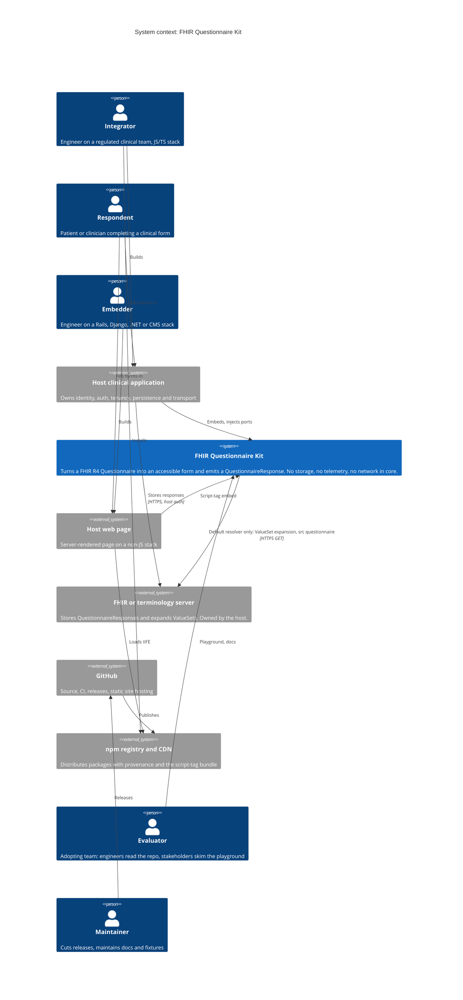
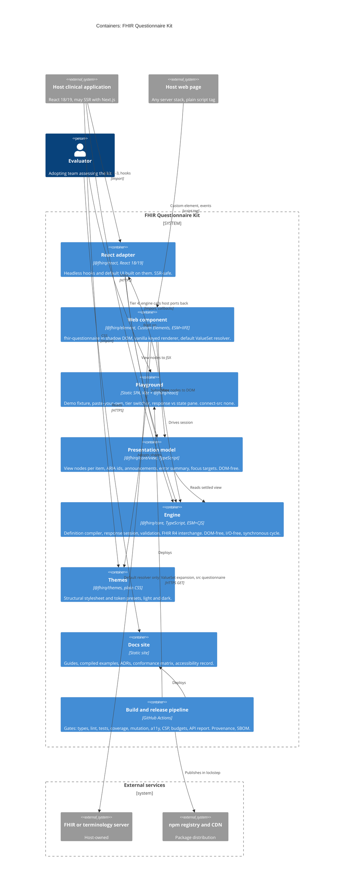

# FHIR Questionnaire Kit — Architecture

*Phase: solution architecture. Input: `03-nfr.md`, `04-domain.md` (with `01-brief.md`, `02-requirements.md` and ADR-0001–0006 for context). Output: candidate architectures, trade-offs against the NFRs, a recommendation, C4 context and container views, and ADR-0007–0019. Next: milestones → build.*

**Status:** Architecture B (§4, ADR-0007) was accepted on 2026-09-15, and so were tensions AT1–AT4 (§9). Assumptions A1 and A2 (§8) were accepted into NFR-S-02. ADR-0008 to ADR-0019 and ADR-0020 were accepted on 2026-09-16 (`06-roadmap.md` §6 decision 2), and so were assumptions A3–A6; tension AT5 was confirmed out of v1 the same day. Spike S1 confirmed Architecture B on 2026-09-17 (§11).

---

## 0. Forces

Not every NFR separates the candidates. These are the ones that do, ranked by how hard they constrain the shape of the system.

| Rank | Force | Why it shapes architecture |
|---|---|---|
| 1 | **NFR-S-01** zero runtime deps · **NFR-S-02/03** bundle budgets | Every UI technique must be hand-written and small. Rules out component frameworks underneath the UI. |
| 2 | **NFR-C-08** SSR with 0 hydration warnings · **NFR-C-03** React 18 *and* 19 · **AC-08.2.1** default UI built on the hook | Forces the React UI to be real React, not a wrapper around something else. |
| 3 | **NFR-A-01…09** WCAG 2.2 AA, verifiable · **AC-10.3.1** override contract carries ARIA identifiers | Accessibility behaviour (ids, announcements, error summary, focus) is the most expensive code to get right, so it should exist once. |
| 4 | **NFR-Z-01** 40–60 hours · **NFR-Z-02** nothing partial | Duplication of the expensive parts is the thing the budget cannot absorb. |
| 5 | **NFR-P-02/09** ≤ 5 ms re-evaluation, recompute set = transitive dependents | Dictates the engine's evaluation strategy (ADR-0009). |
| 6 | **NFR-C-04** DOM-free core · **NFR-X-01/02** no network, no storage | Dictates which layer may touch what. |
| 7 | **NFR-C-07** strict CSP, no inline styles | Dictates how styles reach both renderers, especially inside shadow DOM (ADR-0014). |
| 8 | **NFR-Q-01/03** 95% coverage and mutation testing on core only | Logic placed in core is tested hardest; logic placed in adapters is tested at 85%. Placement is a quality decision. |

`04-domain.md` §9.3 adds five properties the architecture must preserve: small stored state, one visible projection, definition ≠ node, one command → one cycle → one notification, no answer values in diagnostics or events.

---

## 1. Screened out before shortlisting

Each fails a gate outright, so it does not get a full trade-off analysis.

| Candidate | Fails | Reason |
|---|---|---|
| UI built on Lit, Stencil, Preact or similar | NFR-S-01 | A runtime dependency, even bundled. Stencil is also the incumbent's stack (Brief §4). |
| Engine in a Web Worker | AC-01.1.1, INV-D-11, NFR-C-07 | Session creation must be synchronous; a worker makes every read asynchronous and needs `worker-src`. At a 5 ms budget there is no main-thread cost to offload. |
| Questionnaire compiled to code at build time | Brief §3, NFR-C-07 | A questionnaire change would need a release, which is the property the buyer is paying for. Runtime compilation needs `new Function`. |
| `<iframe>` embed | NFR-A-01, US-09.2 | Breaks token theming, height sizing and the focus/screen-reader flow (ADR-0014 option D). |

---

## 2. Three candidate architectures

All three share the same `@fhirq/core` engine: a DOM-free TypeScript library implementing BC1–BC5 from `04-domain.md`. They differ in **where presentation logic lives and how many times it is written.** For this product, that is the decision with consequences.

"Presentation logic" means BC6 behaviour that is not markup: control choice (INV-P-05), accessibility identifiers (INV-P-02), announcement text and coalescing (INV-P-03), the error summary (AC-11.3.1), focus targets after add/remove/refused completion, the inert add control with its reason (INV-P-04), and the unsupported-item placeholder.

### A — Headless core, independent native renderers

```
@fhirq/core ──► @fhirq/react   (React default UI + hooks, presentation logic written in React)
            └─► @fhirq/element (vanilla DOM default UI, presentation logic written again)
@fhirq/themes  (tokens)
```

The textbook headless split. Each renderer is idiomatic and owns all of BC6 for its host.

- **For:** the smallest core; each renderer is free to use its platform's idioms; no extra abstraction to design.
- **Against:** every BC6 rule is written twice, tested twice and manually screen-reader-verified twice. The two default UIs will diverge, and the divergence will show up as accessibility defects in one renderer only. Presentation logic sits in adapter packages, under the weaker 85% coverage gate and outside mutation testing.

### B — Headless core, shared DOM-free presentation model, thin native renderers

```
@fhirq/core        (engine)
@fhirq/core/view   (presentation model: DOM-free, framework-free)
      ▲
      ├── @fhirq/react   (React renderer: maps view nodes to JSX)
      └── @fhirq/element (vanilla renderer: maps view nodes to DOM, in shadow DOM)
@fhirq/themes  (tokens + one structural stylesheet, shared by both renderers)
```

A second entry point in the core package turns a settled session into a **view model**: one plain object per item node, carrying everything a renderer needs to decide except markup. That covers control kind, label and description text, stable ids, ARIA state, surfaced issues, options and their state, and bound command functions. It also produces per-cycle announcements, the error summary and focus targets. Both renderers become mechanical: view node in, markup out, following **one DOM contract** (elements, roles, class names, `part` names) that a shared contract test suite checks against both.

- **For:** each BC6 rule is written once, in Node, under the core coverage and mutation gates. One structural stylesheet serves both renderers because they emit the same markup contract. The tier-3 override contract (AC-10.3.1) is simply the view-node type. Headless integrators get the presentation model without any markup.
- **Against:** an abstraction to design up front, with a real risk of it growing into a home-made virtual DOM. It adds exported types (NFR-U-05) and a new entry point that needs its own byte budget. The vanilla renderer must still patch the DOM by key rather than rebuild it, so it keeps focus and caret position.

### C — Element-first: one web-component UI, React wraps the element

```
@fhirq/core ──► @fhirq/element (the only default UI, vanilla DOM, shadow DOM)
                     ▲
                     └── @fhirq/react (React wrapper around <fhir-questionnaire>, plus headless hooks)
```

One default UI, delivered as a custom element and wrapped for React.

- **For:** the least UI code by far; guaranteed identical look and behaviour everywhere; the element gets the most use and therefore the most testing.
- **Against:** React SSR cannot produce the element's shadow content, so server markup has no form (fails AC-08.3.1, NFR-C-08). React 18 passes objects to custom elements as attributes, so it needs ref-based property wiring (NFR-C-03). `@fhirq/react` has to pull in the element, which breaks the 6 kB budget. The React default UI is no longer built on the hook, so the proof in AC-08.2.1 disappears. React tier-3 overrides render in light DOM through `<slot>`, where `aria-describedby` cannot point at error text inside the shadow root, which breaks AC-10.3.1 and AC-11.2.2.

---

## 3. Trade-offs against the NFRs

✔ meets comfortably · ◐ meets with cost or risk · ✘ fails or requires the NFR to change

| NFR | A — independent renderers | B — shared presentation model | C — element-first |
|---|---|---|---|
| **S-01** zero runtime deps | ✔ | ✔ | ✔ |
| **S-02** bundle budgets | ◐ react ≤ 6 kB is tight with all BC6 logic inside it | ◐ needs a new budget for the `view` entry point (§8 A1); renderers stay small | ✘ react must contain the element (~24 kB) |
| **S-03** IIFE ≤ 30 kB | ✔ | ✔ | ✔ |
| **C-03** React 18 + 19 | ✔ | ✔ | ◐ React 18 custom-element property and event bridging |
| **C-04** DOM-free core | ✔ | ✔ `view` entry is DOM-free by the same lint rule | ✔ |
| **C-07** strict CSP | ◐ solved per renderer | ◐ solved once (ADR-0014), shared stylesheet | ◐ as B |
| **C-08** SSR, 0 hydration warnings | ✔ | ✔ | ✘ no server markup for shadow content |
| **P-02/03** re-evaluation, keystroke | ✔ | ✔ per-node view objects allow memoised re-render | ◐ extra bridge hop per change |
| **P-06** playground Lighthouse | ✔ | ✔ | ✔ |
| **Q-01/03** coverage, mutation | ◐ BC6 logic at 85% and not mutation-tested | ✔ BC6 logic under core gates | ◐ BC6 logic in element at 85% |
| **A-01…09** accessibility | ◐ two implementations to verify; divergence risk | ✔ behaviour once, markup verified by one contract suite | ✘ cross-root ARIA for React overrides |
| **A-02** manual SR passes | ◐ 3 pairs × 2 independent UIs | ◐ 3 pairs × 2 renderers, but behaviour differences are structural only | ✔ 3 pairs × 1 UI |
| **U-01** ≤ 10 lines quickstart | ✔ | ✔ | ✔ |
| **U-05** ≤ 60 public symbols | ✔ fewest | ◐ view-node types are exported, but they double as the tier-3 contract that must exist anyway | ✔ |
| **M-06** architectural lint rules | ✔ | ✔ plus "renderers import `view`, never engine internals" | ✔ |
| **M-07** CI ≤ 10 min | ◐ two UI test suites | ✔ most BC6 tests run in Node | ✔ |
| **AC-08.2.1** default UI on the hook | ✔ | ✔ | ✘ |
| **AC-10.3.1** override receives ARIA ids | ✔ | ✔ | ✘ in React |
| **Z-01** 40–60 hours | ✘ BC6 twice is the single largest duplication available | ◐ one BC6, two thin renderers, abstraction design up front | ◐ least UI code, but the saving is spent fighting SSR and React interop |
| **Brief §6 principle 3** "correct layering" | ◐ conventional | ✔ the strongest layering story, and each layer is independently testable | ✘ layering inverted for React |

**Reading the table.** C fails three hard gates (C-08, S-02, AC-08.2.1) and an accessibility requirement, so it is out despite the least code. A and B both pass every gate. They differ on effort and on accessibility risk, which are ranks 3 and 4 in §0, and B wins both. B's costs are an API-surface cost and an up-front design cost, and both can be contained (ADR-0007).

---

## 4. Recommendation

**Architecture B**, recorded as ADR-0007 and **accepted on 2026-09-15**. It forces the decisions below, all accepted on 2026-09-16:

| Concern | Decision | ADR |
|---|---|---|
| Layering | Headless core, DOM-free presentation model, thin native renderers | 0007 |
| Dependencies | Zero third-party runtime deps; first-party packages released in lockstep | 0008 |
| Engine evaluation | Dependency graph compiled at load; incremental, synchronous, single-writer cycle; immutable per-node views | 0009 |
| State vs document | Engine state, emitted response and snapshot are three models on two code paths | 0010 |
| Retention | `retain-exclude` by default | 0011 |
| Options | Injected resolver; default HTTP resolver in `@fhirq/element` only | 0012 |
| Customization | Four tiers, each stopping at a layer boundary | 0013 |
| Element | Shadow DOM, constructable stylesheets, overrides rendered inside the shadow root | 0014 |
| React adapter | Sessions owned outside components; SSR by construction; controlled mode with echo suppression | 0015 |
| FHIR version | R4 only, behind an internal codec seam | 0016 |
| Expressions | FHIRPath excluded; synchronous evaluator seam for `calculatedExpression` | 0017 |
| Toolchain | Minimal dev toolchain; licence-allowlist conflict on accessibility tooling raised | 0018 |
| Playground and docs | Static, client-only, strict CSP with `connect-src 'none'`, no analytics | 0019 |

### 4.1 Core modules and the domain

The core package is organised by bounded context so that `04-domain.md` can be read against the source tree.

| Module | Bounded context | May import | Must not import |
|---|---|---|---|
| `kernel/` | Shared kernel | — | anything |
| `fhir/r4/` | FHIR codec (ADR-0016) | `kernel` | engine modules |
| `definition/` | BC1 | `kernel`, `fhir/r4` (parse only) | `session`, `validation`, `interchange` |
| `session/` | BC2 | `kernel`, `definition` | `fhir/*`, `interchange`, `view` |
| `validation/` | BC3 | `kernel`, `definition`, `session/projection` | `session` internals, `fhir/*` |
| `interchange/` | BC4 | `kernel`, `definition`, `session/projection`, `session/snapshot`, `fhir/r4` | `session` internals |
| `resume` (entry `@fhirq/core/resume`; ADR-0021) | BC4's way back in: snapshot, restore, decode, hydrate | `kernel`, `definition`, `session`, `interchange`, `fhir/r4` | — ; nothing reachable from `index` or `view` may import `resume`, `session/snapshot`, `interchange/decode` or `interchange/hydrate` |
| `ports/` | BC5 | `kernel` | everything else; types only, held by lint from M4 (`CORE_TYPES_ONLY`: no statement in it may emit JavaScript) |
| `view/` (entry `@fhirq/core/view`) | BC6, DOM-free half | `kernel`, public engine API | engine internals, DOM globals |

The import restrictions are enforced by lint (NFR-M-06). ADR-0021 adds a bundle check as well: no input from the `resume` row may appear in the `@fhirq/core`, `@fhirq/core/view`, `@fhirq/element` or IIFE bundles. Only `session/session` and `session/snapshot` may import the session's internal state registry. One row is the architectural claim of US-05.3: `interchange/emit` can reach answers **only** through `session/projection`, so it has no way to read a disabled node (AC-05.3.2).

**File rows, from M3.** Some rows are for single files, and take the place of their module's row. The root files get rows of their own. The lint rule holds each row with a must-fail fixture (`fhirq/core-module-imports`, `eslint.config.js` `CORE_FILES` and `CORE_IMPORTERS`).

| File | May import | Only these may import it |
|---|---|---|
| `index` (entry `@fhirq/core`) | `kernel`, `definition`, `session`, `fhir/r4`, `interchange/emit`, `open`, `ports` | — |
| `open` (internal; what `index` and `resume` share to start a session) | `kernel`, `definition`, `session`, `validation`, `fhir/r4/parse` | — |
| `resume` (entry `@fhirq/core/resume`) | `kernel`, `definition`, `session`, `interchange`, `fhir/r4`, `open`, `index` | nothing |
| `interchange/emit` | `kernel`, `definition`, `session/projection`, `fhir/r4` | — |
| `session/registry` | its module's row | `session/session`, `session/snapshot` |
| `session/snapshot` | its module's row | `resume`, `interchange/hydrate` |
| `interchange/hydrate` | its module's row | `resume` |
| `interchange/decode` | its module's row | `interchange/hydrate` |
| `fhir/r4/decode` | its module's row | `resume` |

Two things go beyond ADR-0021's rows, and neither loosens one. `resume` also imports `open` and `index` (types only), so that restore and hydration read options and compose validation exactly as `createSession` does, rather than keeping a second copy of that code. And `fhir/r4/decode`, the stored-response codec, is resume-only code like the rest, so it is under the same importer rule and bundle check.

**From M4,** `index` re-exports the three port types, and is the only importer of `ports/` (`06-roadmap.md` M4 D1). The engine modules that call a port type its call in their own terms, so no port can grow a reach into session state. One DOM-Standard name is admitted in core: `AbortController`, in `session/options` only, to abort the resolver's signal on dispose (ADR-0012 amendment note; `eslint.config.js` `ABORT_ALLOWED`).

---

## 5. C4 Level 1 — System context

The system in scope is the kit: published packages plus the playground and docs sites. At runtime the library runs inside someone else's application, so the host application, not the kit, is what the respondent uses.



**What the diagram claims.** Exactly one arrow leaves the kit towards a network service, and it starts at the element's default resolver (AC-07.1.3). That one file makes two kinds of request, both `GET`s: a value set's `$expand` when `value-set-base` is set and no `resolver` is given, and the questionnaire named by the `src` attribute (AC-09.1.1; ADR-0012 amendment note, 2026-09-25). Everything the respondent enters stays inside the host application's process until the host pulls it out (INV-S-34, `04-domain.md` §9.3 property 5).

---

## 6. C4 Level 2 — Containers

For a library, "containers" are the separately published or deployed units. `@fhirq/core` and `@fhirq/core/view` are one npm package with two entry points; they are drawn separately because they have separate budgets and import rules.



### 6.1 Container responsibilities and budgets

| Container | Bounded contexts | Budget (NFR-S-02/03) | Network | DOM |
|---|---|---|---|---|
| Engine `@fhirq/core` | BC1–BC5 | ≤ 15 kB (ADR-0022) | none (NFR-X-01) | none (NFR-C-04) |
| Presentation model `@fhirq/core/view` | BC6, DOM-free half | ≤ 8.2 kB (measured, ADR-0023) | none | none |
| React adapter | BC6 markup | ≤ 6 kB excl. React, core, view and resume (4.13 kB, gated from M6) | none | via React |
| Web component | BC6 markup + default resolver | ≤ 24 kB incl. core, view, theme | `default-resolver.ts` only: value-set `$expand` and the `src` questionnaire (ADR-0012 note) | yes |
| Themes | — | ≤ 3 kB per preset; structural sheet ≤ 4 kB | none | — |
| Script-tag IIFE | all of the element | ≤ 30 kB | as the web component | yes |

---

## 7. How the recommendation meets the domain's five must-preserve properties

| `04-domain.md` §9.3 | Where the architecture guarantees it |
|---|---|
| 1. Stored state is small | ADR-0010: stored state is five structures; all else recomputed. Snapshot serialises only those. |
| 2. One visible projection | §4.1 import rules: `validation/` and `interchange/` reach answers only via `session/projection`; `view/` only via the public engine API; `ports/` is types only and never reads answers. |
| 3. Definition ≠ node | ADR-0009: definitions in compiled tables indexed by item id; nodes keyed by ordinal path; scopes resolve per repeat instance. |
| 4. One command → one cycle → one notification | ADR-0009: single-writer queue, re-entrant commands deferred, notification after settle. ADR-0015: React reads through `useSyncExternalStore`, so it cannot see `Evaluating`. |
| 5. No values in diagnostics or events | ADR-0009: events carry paths and flags only; lint rule bans interpolating answer values into diagnostic messages; NFR-X-04 test. |

---

## 8. New assumptions introduced by architecture

Extends `03-nfr.md` §11. Correct before milestone planning. **A1 and A2 were accepted on 2026-09-15; A3–A6 on 2026-09-16, in M0; A7 on 2026-09-17, with ADR-0021.** M3 measured A7's figure on 2026-09-18 and it holds.

| # | Ref | Assumption | Why it matters |
|---|---|---|---|
| A1 | NFR-S-02 | **Accepted 2026-09-15, now in NFR-S-02.** New budgets: `@fhirq/core/view` ≤ 5 kB; `@fhirq/themes` structural stylesheet ≤ 4 kB | Architecture B adds two entry points that NFR-S-02 did not list |
| A2 | NFR-S-02 | **Accepted 2026-09-15, now in NFR-S-02.** The React ≤ 6 kB budget excludes core and view, as it already excludes React | Otherwise React's budget is smaller than core alone |
| A3 | NFR-S-01 | **Accepted 2026-09-16.** "0 direct runtime deps" means **third-party**. `@fhirq/*` packages depend on each other at exact versions and release in lockstep (ADR-0008). Mechanical from M0: Changesets is configured in fixed mode over the four packages, and the cross-dependencies are `workspace:0.0.0` | Taken literally, `@fhirq/react` could not depend on `@fhirq/core`. Ranges would leave NFR-S-01 unprovable |
| A4 | NFR-C-01 | **Accepted 2026-09-16.** The iOS Safari 16.4 floor is load-bearing: constructable stylesheets, the element's CSP-safe styling mechanism, arrive there (ADR-0014). It is also the floor NFR-A-02's iOS screen-reader pair verifies each release | Lowering the floor costs a second, CSP-compatible styling mechanism carried in the bundle, against R1, which `06-roadmap.md` §1 already calls arithmetically tight |
| A5 | AC-05.3.3 | **Accepted 2026-09-16.** Snapshots carry a format version; restore accepts the same format major only; a format change is a semver-major change of core (ADR-0010) | Otherwise "snapshots are not a migration format" has no mechanical meaning across library upgrades, and AC-05.3.3 has nothing to assert |
| A6 | NFR-Q-03 | **Accepted 2026-09-16.** Mutation testing runs incrementally on changed engine modules per PR; the full run is nightly and blocks release, not merge (ADR-0018) | A full run will not fit NFR-M-07's 10 minutes (ADR-0018 option G). Accepted cost: a change that weakens tests in an unchanged file is caught nightly rather than at merge |
| A7 | NFR-S-02 | **Accepted 2026-09-17 with ADR-0021; confirmed 2026-09-18 by its first reading (M3): 3.34 kB of 4 kB, 8.88 kB minified, gated from M3.** `@fhirq/core/resume` ≤ 4 kB gzipped, excluding `@fhirq/core`; `@fhirq/react`'s budget also excludes it. Estimated from 5.8–11.6 kB minified (1.9–4.9 kB gzipped) | Core's M2 reading tripped `03-nfr.md` §2's tripwire; moving resume code out of the main entry point keeps core's and the element's budgets without cutting the embed or the spec surface |

---

## 9. Tensions raised for product

**AT1–AT4 were accepted as proposed on 2026-09-15** and are folded into `02-requirements.md` (indexed in its §20) and `03-nfr.md`. **AT5 was resolved on 2026-09-16** (`06-roadmap.md` §6 decision 13): out of v1.

| # | Tension | Resolution | ADR |
|---|---|---|---|
| AT1 | **NFR-S-07 vs NFR-A-01.** The de facto automated accessibility engine, axe-core, is MPL-2.0, which is not on the dev licence allowlist. | Add MPL-2.0 to the allowlist **for dev-only tooling that is never bundled or redistributed**. Fallback: IBM Equal Access checker (Apache-2.0), with weaker ecosystem support. | 0018 |
| AT2 | **AC-08.1.2 controlled mode vs retention.** If the controlled value is a `QuestionnaireResponse`, echoing it back each render would rehydrate and silently drop retained answers and surfacing state. | Prefer controlling by `session`. For a response-valued `value`, ignore values semantically equal to the last emitted response, and rehydrate only on a genuine external change, documenting that this resets retention. | 0015 |
| AT3 | **Silent expression extensions.** An unsupported `enableWhenExpression` or `answerExpression` ignored at load would show questions the author meant to hide. | Treat them like unsupported item types: reject in `strict` mode, diagnostic plus item disabled in `lenient` mode. Now AC-01.3.3 and INV-D-15. | 0017 |
| AT4 | **NFR-X-09 playground analytics.** Left undecided by `03-nfr.md`; resolved there on 2026-09-15 (N16, §12 #8). | **None.** Rely on GitHub traffic stats. The playground's CSP then denies all connections, which makes AC-12.3.2 browser-enforced. | 0019 |
| AT5 | **Element form participation.** An embedder in a Rails or Django `<form>` will expect the response to submit with the form. Not in requirements. | **Out of v1, confirmed 2026-09-16,** and recorded as a follow-up: a form-associated custom element via `ElementInternals`. It is a second serialisation path beside the emitted `QuestionnaireResponse`, it is in no requirement, and `ElementInternals` form association is itself Safari 16.4+ — so adding it later does not move A4. | 0014 |

---

## 10. ADR index for this phase

| ADR | Title |
|---|---|
| [0007](adr/0007-layered-architecture-with-shared-presentation-model.md) | Layered architecture: headless core, shared presentation model, thin native renderers |
| [0008](adr/0008-zero-runtime-dependencies.md) | Zero third-party runtime dependencies, enforced mechanically |
| [0009](adr/0009-incremental-evaluation-over-compiled-graph.md) | Incremental evaluation over a dependency graph compiled at load |
| [0010](adr/0010-state-model-separate-from-emitted-document.md) | Engine state, emitted response and snapshot are separate models |
| [0011](adr/0011-retain-hidden-answers-exclude-from-response.md) | Answers to hidden items are retained and excluded from the response by default |
| [0012](adr/0012-injected-option-resolver.md) | Option lists come from an injected resolver; only the element ships a default |
| [0013](adr/0013-customization-tiers-as-layer-boundaries.md) | Four customization tiers, each stopping at a layer boundary |
| [0014](adr/0014-shadow-dom-with-constructable-stylesheets.md) | The element renders into shadow DOM styled by constructable stylesheets |
| [0015](adr/0015-react-adapter-session-ownership-and-ssr.md) | React adapter: sessions owned outside components, SSR by construction |
| [0016](adr/0016-fhir-r4-only-behind-codec-seam.md) | FHIR R4 only, behind an internal codec seam |
| [0017](adr/0017-fhirpath-excluded-evaluator-seam.md) | FHIRPath is excluded; expressions route through an evaluator seam |
| [0018](adr/0018-build-and-verification-toolchain.md) | Build and verification toolchain under the licence allowlist |
| [0019](adr/0019-static-client-only-playground-and-docs.md) | Playground and docs are static, client-only and run under a strict CSP |

---

## 11. Go/no-go on Architecture B after spike S1

*M1 AC-9. Evidence: `00-s1-architecture-and-bytes.md`. **Decision: continue.** Recommended 2026-09-16; approved by the maintainer 2026-09-17, together with the budget verdict in `03-nfr.md` §2 and the AC-3 field-list review.*

**What S1 set out to break, and did not.** One DOM-free view model drove a React renderer and a keyed vanilla renderer to identical markup, roles, accessible names and ARIA relationships in every state of the slice, asserted by one contract suite (AC-4). Neither renderer needed a field naming an element, an ARIA attribute or a CSS property (AC-3), and neither computes visibility, validity, ids or response shape. Axe found nothing in 24 runs (AC-5); React 18 and 19 hydrated with no warnings (AC-6); the element kept caret and focus through cycles that change the focused input's own state, on Chromium and WebKit (AC-7); and it rendered under `style-src 'self'` with adopted stylesheets only (AC-8). None of S1's three kill criteria triggered.

**What S1 did not settle.**
- **R1 stays open.** The element's extrapolated band, 12.6–35.5 kB, straddles its 24 kB budget; the view's, 3.0–9.0 kB, straddles 5 kB. Architecture B is not what is at risk here — Architecture A would carry the same engine and theme, and a heavier BC6 in each renderer — but the published numbers may be.
- **R2 is proven on two control kinds,** not fourteen. The drift ADR-0007 fears is gradual; the deny-list test that caught `code` in S1 carries into M5. **Settled for the view on 2026-09-23 (M5):** eighteen control kinds, a tree whose unchanged subtrees keep their identity, and a field list with no markup names. The deny-list test caught `position` (a CSS property) on the way; the field is now `number`. What stays open is whether M6 and M7 need a field the view lacks. That is the one way R2 can still fail, and ADR-0023's margin is sized for it. **M6 (2026-09-24) needed none;** repeating-question entries with no identity of their own are the one gap it recorded.
- **Two accepted ADRs disagreed on a name; resolved 2026-09-17.** ADR-0020's `display` field is a CSS property under ADR-0007's review rule. It is allowed as a coincidence, like `label` and `clear`: it is ADR-0020's name and FHIR's own word for rendered text (`Coding.display`), and it means formatted text, not styling. M5 adds it to the allowed list when the field lands.
- **Leaving an item is decided in both renderers** (focus containment), the one duplicated behaviour left. M5 decides whether the DOM contract states it or `view/` helps. **Decided 2026-09-23 (M5 plan D11):** the DOM contract states it (`08-dom-contract.md` §1, the leave rule). `leave()` fires on `focusout` from the item root when `relatedTarget` is outside it; a view helper would need the DOM.

**What M2 keeps from the spike** (P4: nothing is kept by default).

| Kept, as a starting point | What it becomes |
|---|---|
| `scripts/measure-bundles.mjs` and its test | The budget gate from M2 |
| The `tests/browser/` harness and all five specs | The SSR (M6), CSP (M7) and accessibility (M8) gates. **SSR done 2026-09-24:** `hydration.spec.ts` at full breadth, in the required `React gates` job |
| `packages/core/test/deny-lists.ts` and `view-fields.test.ts` | The AC-3 check for M5 |
| `view/ids.ts`, `view/format.ts` | Starting points for M5's view |
| The element's inline-style lint bans and their must-fail tests | The CSP guard for M7 |
| The `@fhirq/themes` token-contract test; `docs/08-dom-contract.md` | The contract's first rows, completed in M5 and M8 |

| Rewritten | Why |
|---|---|
| `session/session.ts` | A naive full pass; ADR-0009's compiled graph and recompute set replace it (M2). **Done 2026-09-17:** the naive pass survives only as `packages/core/test/oracle.ts`, the independent oracle the property tests compare against |
| `definition/definition.ts` | Hand-built input and four checks; M2's R4 codec and INV-D-01…19 replace it. **Done 2026-09-17:** deleted; `fhir/r4/parse.ts` and `definition/{compile,checks,graph,scc}.ts` replace it |
| `view/view.ts` | Two control kinds; M5 writes the full field list |
| `validation/required.ts` | One rule; M3 |
| `packages/element/src/{element,items}.ts` | M7's patcher covers every control kind and tier 3 |
| `packages/react/src/questionnaire.tsx` | M6's hook, tiers and controlled mode. **Done 2026-09-24:** `hook.ts` (`useQuestionnaire`), `ui/*.tsx` (the default UI and tier-3 chrome), `echo.ts` (the echo compare), `contract.ts` and `report.ts` (the development check and the diagnostic channel); `questionnaire.tsx` is the hook and `ui/form`. The quickstart is `examples/react-quickstart/`, a workspace package that consumes the published entry points, the pattern M8 and M10 reuse for compiled samples (M6 plan D7) |
